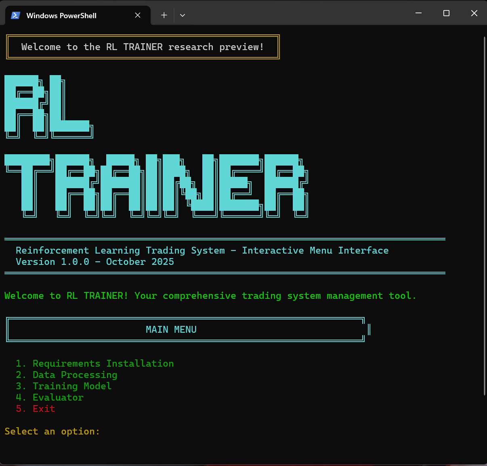
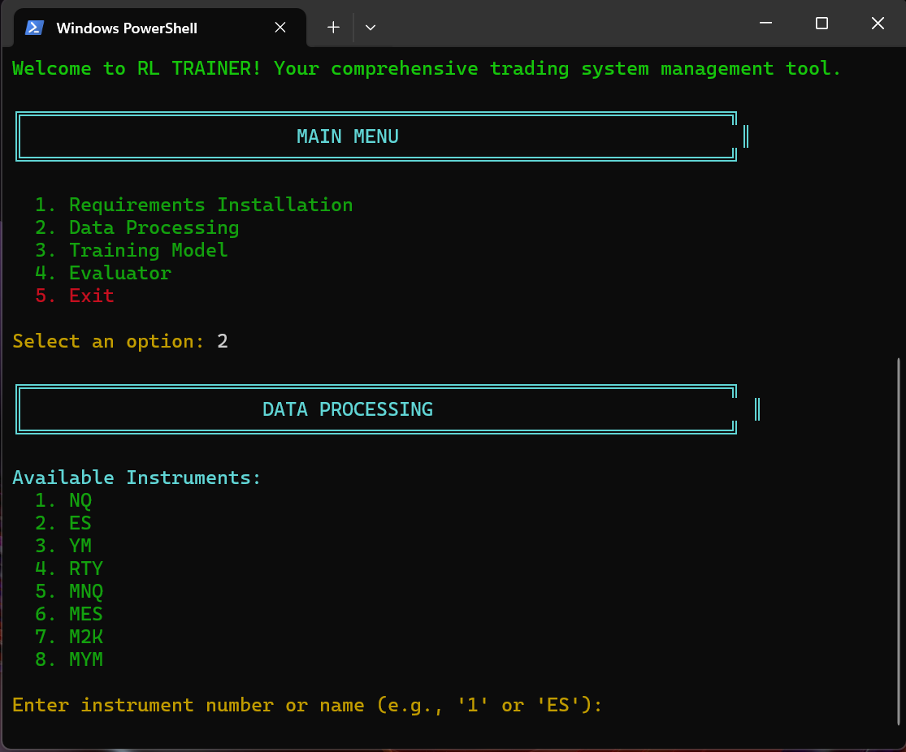
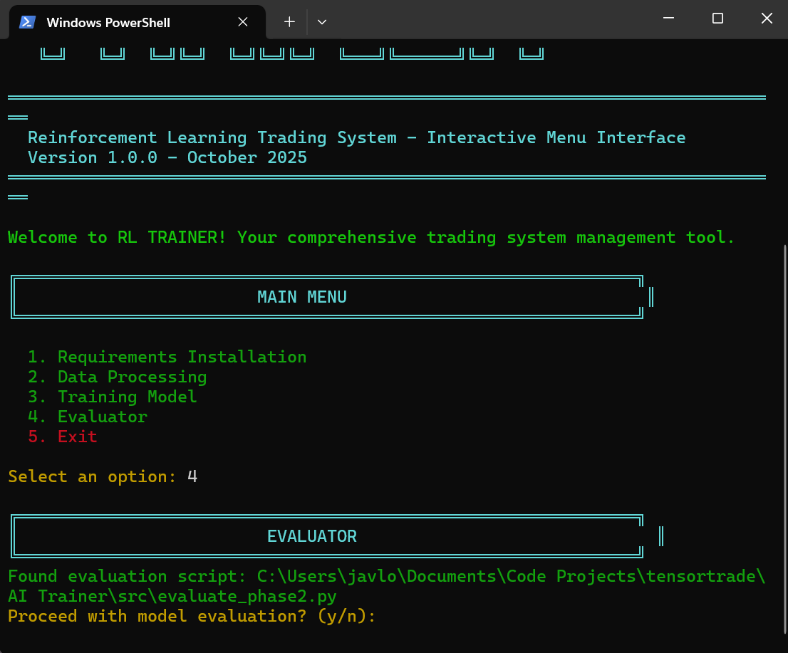

# AI - TRAINER - AI Trading System



A comprehensive reinforcement learning trading system with an interactive command-line interface for managing the complete ML pipeline from data processing to model evaluation.

## Overview

This project implements a two-phase curriculum learning approach for training trading agents that comply with Apex Trader Funding rules. The system uses PPO (Proximal Policy Optimization) algorithm with transfer learning to develop robust trading strategies.

## Features

- **Interactive CLI Menu System** - Easy-to-use interface for all operations
- **Two-Phase Training Pipeline** - Curriculum learning approach
  - Phase 1: Entry signal quality learning (fixed SL/TP)
  - Phase 2: Position management with dynamic SL/TP
- **Continue Training from Checkpoint** - Resume training from any saved model
- **Smart Model Detection** - Automatically finds and loads the newest models
- **Data Processing** - Support for 8 major futures instruments
- **Model Evaluation** - Comprehensive performance metrics
- **Compliance Enforcement** - 100% Apex Trader Funding rules compliance
- **Progress Tracking** - Colored output and detailed logging

## Supported Instruments



- **NQ** - Nasdaq 100 E-mini
- **ES** - S&P 500 E-mini
- **YM** - Dow Jones E-mini
- **RTY** - Russell 2000 E-mini
- **MNQ** - Micro Nasdaq 100
- **MES** - Micro S&P 500
- **M2K** - Micro Russell 2000
- **MYM** - Micro Dow Jones

## Project Structure

```
AI Trainer/
├── main.py                      # Interactive menu system (main entry point)
├── README.md                    # This file
├── requirements.txt             # Python dependencies
├── setup.py                     # TensorTrade package setup
│
├── src/                         # Core source code
│   ├── __init__.py
│   ├── environment_phase1.py    # Phase 1 trading environment
│   ├── environment_phase2.py    # Phase 2 trading environment
│   ├── feature_engineering.py   # Feature extraction
│   ├── technical_indicators.py  # Technical indicators
│   ├── kl_callback.py           # KL divergence monitoring
│   ├── model_utils.py           # Model detection and loading utilities
│   ├── train_phase1.py          # Phase 1 training script
│   ├── train_phase2.py          # Phase 2 training script
│   ├── evaluate_phase2.py       # Model evaluation
│   ├── update_training_data.py  # Data processing script
│   ├── clean_second_data.py     # Second-level data cleaning
│   └── process_second_data.py   # Second-level data processing
│
├── data/                        # Training data (CSV files)
│   └── .gitkeep
│
├── models/                      # Saved model checkpoints
│   └── .gitkeep
│
├── logs/                        # Training and execution logs
│   └── .gitkeep
│
├── results/                     # Evaluation results
│   └── .gitkeep
│
├── tensorboard_logs/            # TensorBoard logs
│   └── .gitkeep
│
├── img/                         # Screenshots and images
│   └── .gitkeep
│
├── tests/                       # Test suite
│   ├── __init__.py
│   ├── test_environment.py      # Environment tests
│   └── test_integration.py      # Integration tests
│
├── docs/                        # Documentation
│   └── Apex-Rules.md            # Apex Trader Funding compliance rules
│
└── tensortrade/                 # TensorTrade package source
    └── (complete package)
```

## Installation

### Prerequisites

- Python 3.11.9 or higher
- pip (Python package manager)
- (Optional) CUDA-compatible GPU for faster training

### Step 1: Install Dependencies

Run the main menu and select option 1, or install manually:

```bash
# Using main.py menu (recommended)
python main.py
# Select option 1: Requirements Installation

# Or install manually
pip install -r requirements.txt
```

### Step 2: Verify Installation

```bash
# Test imports
python -c "import gymnasium, stable_baselines3, pandas, numpy; print('✓ All core dependencies installed')"

# Or run the verification script
python tests/test_setup.py
```

## Quick Start

### Using the Interactive Menu (Recommended)

```bash
python main.py
```

The interactive menu provides 5 main options:

1. **Requirements Installation** - Install all dependencies
2. **Data Processing** - Process market data for training
3. **Training Model** - Train Phase 1 and Phase 2 models
   - Training Test (Local Testing)
   - Training Pod (Production)
   - **Continue from Existing Model** ⭐ NEW
4. **Evaluator** - Evaluate trained models
5. **Exit** - Close the program



### Continue Training Feature ⭐ NEW

Resume training from any previously saved model:

```bash
python main.py
# Select 3: Training Model
# Select 3: Continue from Existing Model
# Choose from list of available models
# Select test or production mode
```

**Benefits:**
- Resume interrupted training sessions
- Extend training for models that haven't converged
- Continue training with different hyperparameters
- No need to remember model names - automatic detection
- Preserves timestep count and training progress

**Command-line usage:**
```bash
# Continue training from a specific model
python src/train_phase1.py --continue --model-path models/phase1_foundational_final.zip

# Continue in test mode
python src/train_phase1.py --continue --model-path models/phase1_foundational_final.zip --test
```

### Manual Workflow

#### 1. Process Data

```bash
python src/update_training_data.py --market ES
```

Available markets: NQ, ES, YM, RTY, MNQ, MES, M2K, MYM

#### 2. Train Models

```bash
# Phase 1: Entry Signal Learning (2M timesteps)
python src/train_phase1.py

# Phase 2: Position Management (5M timesteps with transfer learning)
python src/train_phase2.py
```

For quick testing (reduced dataset):

```bash
python src/train_phase1.py --test
python src/train_phase2.py --test
```

#### 3. Evaluate Model

```bash
python src/evaluate_phase2.py
```

#### 4. View Training Progress

```bash
tensorboard --logdir tensorboard_logs/
```

## System Architecture

### Two-Phase Curriculum Learning

```
Phase 1: Entry Signal Learning
  ├─ Fixed SL/TP (1.5x ATR SL, 3:1 ratio)
  ├─ 3 actions: Hold, Buy, Sell
  ├─ Focus: Entry signal quality
  └─ Duration: 2M timesteps (~6-8 hours on RTX 4000)

Phase 2: Position Management (Transfer Learning)
  ├─ Auto-loads newest Phase 1 model
  ├─ Inherit Phase 1 weights
  ├─ Dynamic SL/TP adjustment
  ├─ 9 actions: Complex position management
  ├─ Focus: Risk management
  └─ Duration: 5M timesteps (~8-10 hours)
```

### Multi-Layer Safety System

```
Layer 1: Environment Level (Primary)
  └─ Apex rules enforced in reward + done signal

Layer 2: Wrapper Level (Secondary)
  └─ Safety validation before action execution

Layer 3: Validation Level (Verification)
  └─ Post-training compliance checks
```

## Apex Trader Funding Compliance

The system enforces 100% compliance with Apex rules:

- 4:59 PM ET mandatory position close
- $2,500 max trailing drawdown limit
- $1,000 daily loss limit
- No overnight positions
- Position size constraints
- Trade frequency limits

See `docs/Apex-Rules.md` for complete compliance details.

## Configuration

### Phase 1 Configuration (src/train_phase1.py)

```python
PHASE1_CONFIG = {
    'total_timesteps': 2_000_000,
    'num_envs': 80,
    'learning_rate': 3e-4,
    'batch_size': 512,
    'device': 'cuda'  # or 'cpu'
}
```

### Phase 2 Configuration (src/train_phase2.py)

```python
PHASE2_CONFIG = {
    'total_timesteps': 5_000_000,
    'num_envs': 80,
    'learning_rate': 3e-4,
    'batch_size': 512,
    'device': 'cuda'  # or 'cpu'
}
```

## Data Format

Training data should be CSV files with the following columns:

**Minute Data (D1M):**
- DateTime
- Open, High, Low, Close
- Volume

**Second Data (D1S):**
- DateTime
- Open, High, Low, Close
- Volume

Data files should be placed in `data/` directory with naming convention:
- `{INSTRUMENT}_D1M.csv` (minute data)
- `{INSTRUMENT}_D1S.csv` (second data)

## Testing

Run the test suite:

```bash
python -m pytest tests/ -v
```

Run specific tests:

```bash
# Environment tests
python -m pytest tests/test_environment.py -v

# Integration tests
python -m pytest tests/test_integration.py -v
```

## Troubleshooting

### CUDA Out of Memory

Reduce batch size or number of parallel environments:

```python
# In train_phase1.py or train_phase2.py
'batch_size': 256,  # Down from 512
'num_envs': 40,     # Down from 80
```

Or use CPU:

```python
'device': 'cpu'
```

### Training Divergence

- Reduce learning rate: `3e-4` → `1e-4`
- Increase clip range: `0.2` → `0.3`
- Check reward scaling

### Import Errors

Ensure TensorTrade is installed:

```bash
python setup.py install
```

### Model Not Found

If Phase 2 can't find Phase 1 model:
- The system now auto-detects the newest Phase 1 model
- Ensure you've completed Phase 1 training
- Check `models/` directory for Phase 1 models

## Performance Metrics

Target metrics for successful training:

| Metric | Target | Status |
|--------|--------|--------|
| Apex Compliance | 100% | Enforced |
| Sharpe Ratio | > 2.5 | Phase 2 target |
| Win Rate | > 50% | Target |
| Max Drawdown | < 5% | Enforced |
| GPU Utilization | 85%+ | Optimized |

## Logs and Outputs

- **Training logs**: `logs/`
- **TensorBoard logs**: `tensorboard_logs/`
- **Model checkpoints**: `models/`
- **Evaluation results**: `results/`

## Tips

- All operations are logged for debugging
- Press Ctrl+C to cancel any operation
- Check logs directory for detailed output
- Ensure sufficient disk space (>10GB for full training)
- Use test mode (`--test` flag) for quick validation
- Monitor GPU/CPU usage during training
- Use "Continue Training" to resume interrupted sessions
- Phase 2 automatically finds your newest Phase 1 model

## Common Workflows

### 1. First Time Setup

```bash
python main.py
# Select 1: Requirements Installation
# Select 2: Data Processing (choose instrument)
```

### 2. Complete Training Pipeline

```bash
python main.py
# Select 3: Training Model → 2: Training Pod (Production)
# Wait for completion (~14-18 hours total)
# Select 4: Evaluator
```

### 3. Quick Test Run

```bash
python main.py
# Select 3: Training Model → 1: Training Test (Local)
# Wait for completion (~30-60 minutes)
# Select 4: Evaluator
```

### 4. Resume Training (NEW)

```bash
python main.py
# Select 3: Training Model → 3: Continue from Existing Model
# Select model from list
# Choose test or production mode
# Training continues from checkpoint
```

## Technology Stack

- **RL Framework**: Stable Baselines3 (PPO algorithm)
- **Action Masking**: sb3-contrib (MaskablePPO)
- **Environment**: Gymnasium API
- **Trading Library**: TensorTrade
- **Deep Learning**: PyTorch 2.0+
- **Data Processing**: Pandas, NumPy
- **Visualization**: Matplotlib, Plotly, TensorBoard
- **UI**: Colorama, tqdm, rich

## License

Apache License 2.0 (inherited from TensorTrade)

## Contributing

1. Run tests before committing: `pytest tests/ -v`
2. Follow existing code style
3. Update documentation for new features
4. Ensure Apex compliance for any trading logic changes

## Support & Contact

For questions, suggestions, or discussions:

**X (Twitter)**: [@javiertradess](https://x.com/javiertradess)

For technical issues:
1. Check logs in `logs/` directory
2. Review `docs/Apex-Rules.md` for compliance questions
3. Run tests to diagnose issues: `pytest tests/ -v`

## Version

**RL TRAINER v1.0.0** - October 2025
Based on TensorTrade v1.0.4-dev1

## Author

Javier - [@javiertradess](https://x.com/javiertradess)

---

**Getting Started**: Run `python main.py` and follow the interactive menu!

## Recent Updates

### Continue Training Feature (Latest)
- ✅ Resume training from any saved model
- ✅ Smart model detection - no need to remember filenames
- ✅ Test and production modes supported
- ✅ Preserves timestep count and training progress
- ✅ Custom save names after training completion
- ✅ Phase 2 auto-detects newest Phase 1 model

### System Optimizations
- ✅ Thread pool management for stable training on constrained systems
- ✅ Improved multi-environment handling
- ✅ Enhanced error messages and diagnostics
- ✅ VecNormalize state preservation

---

**Star this repo if you find it useful!** ⭐
